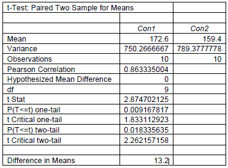
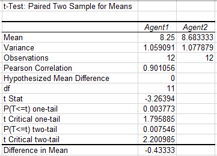
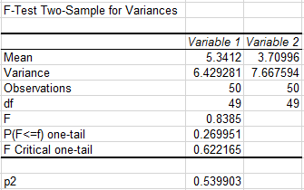
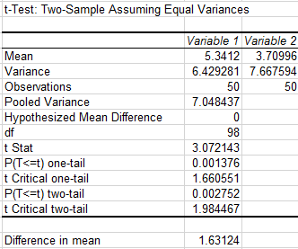

# Statistical Inference
1) Applying statistical Inference on dataset "Designs"

The Data set contains two different design container for each store
#Question
which design has more sale?

The T-stest of paired two sample means is execute in Excel 
with help of data analysis feature

The mean difference calculated by mean 172.6-159.4=13.2

Which clearly state that design 1 sale are greater then 
design 2 by an estimate of 13.2 items each store
So design1 should be consider

If you only consider a one tail t-test for design1 it also suggest that Pvalue=0.009 is within 5% confidence interval
and should still follow design1

2) The Data set contains two different filration agents for each batch
#Question
Whether the population mean impurity differs between the two filtration agents?

The T-stest of paired two sample means is execute in Excel 
with help of data analysis feature

The mean difference calculated by mean 8.25-8.68=-0.43

Which clearly state that Agent1 sale are less then 
Agent2 by an estimate of 0.43 items each store
So Agent2 should be preffer.

3) Test whether the population mean weight loss differs between the two diets
   As the dataset record values of two different diets on each individual(i-e no one went for both diets)
   hence Independent t test is appropriate.
   
   
   
   Thus the two tailed p value P2 0.5399 state its higher then significance level of 5%, it means
   weight loss variance of two population has equal variance, we will consider equal variance form of unrelated samples t test.
  
   
   
   Here associated two tailed pvalue is 0.0028 which is in signicance level of 5%.
   and mean is 1.63 which suggest dieat A is more productive in weight loss
   
