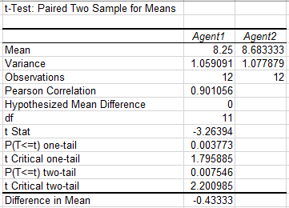

# Statistical Inference
Applying statistical Inference on dataset "Designs"

The Data set contains two different design container for each store
#Question
which design has more sale?

The T-stest of paired two sample means is execute in Excel 
with help of data analysis feature

The mean difference calculated by mean 172.6-159.4=13.2

Which clearly state that design 1 sale are greater then 
design 2 by an estimate of 13.2 items each store
So design1 should be consider

If you only consider a one tail t-test for design1 it also suggest that Pvalue=0.009 is within 5% confidence interval
and should still follow design1

The Data set contains two different filration agents for each batch
#Question
Whether the population mean impurity differs between the two filtration agents?

The T-stest of paired two sample means is execute in Excel 
with help of data analysis feature

The mean difference calculated by mean 8.25-8.68=-0.43

Which clearly state that Agent1 sale are less then 
Agent2 by an estimate of 0.43 items each store
So Agent2 should be preffer.

